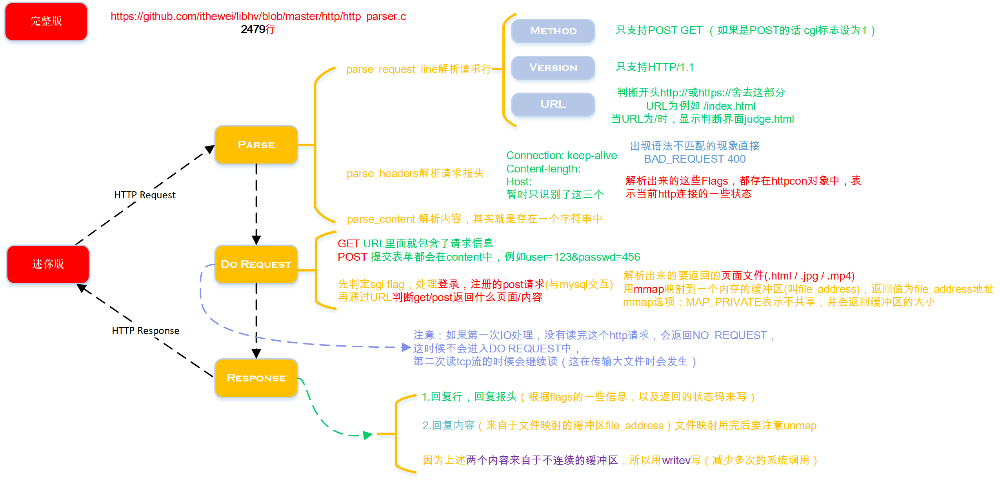

# hp-server
C++ Linux Server
- [x] 单线程I/O多路复用 epoll eventloop (最初版本没有工作线程)
  - [x]设置套接字为非阻塞模式，否则recv, send必须要求读完所有字节才返回
  - [x]处理accept连接时支持 LT / ET 模式
  - [x]处理read,write时支持 LT / ET 模式
  - [ ]注意：ET模式下，用户缓冲区填满的话，需要循环读/写
- [x] 定时器管理连接：对每个连接设置定时器，读写会刷新调整定时器，超时会关闭连接
  - [x]通过排序双向链表实现
  - [x]通过红黑树/大顶堆改进
- [x] 信号处理
  - [x]连接关闭时SIGPIPE信号处理
  - [x]SIGTERM信号处理
  - [x]定时器发送的SIGALRM信号处理
- [x] 半同步半反应堆模式(Half-Sync/Half-Reactor, HSHR): 三层结构
  - [x]工作队列通过stl链表实现
  - [x]主线程(reactor)往工作队列中插入任务，工作线程通过竞争来取得任务并执行它
  - [x]支持reactor/proactor的read, write，对于proactor模式：通过同步I/O模拟
  - [x]线程池
- [x] tcp连接压力测试
- [x] 日志系统LOG
  - [x]单例模式，c++11静态成员函数的静态局部变量
  - [x]同步处理日志模式
  - [x]异步处理日志模式: 线程安全的阻塞队列
    - 互斥锁+信号变量实现：大粒度全局锁（因为异步写日志，可能对性能影响也不大）
    - (改进：基于atomic操作CAS实现lock-free queue，防止ABA，采用了延迟回收技术)
- [x] 处理http请求，并作出正确响应 
  - [x]对http服务器，通过webbench压测
  - [x]只支持POST,GET方法，只支持HTTP/1.1, header只支持connection:keep-alive, content-length，状态码也没有支持很多
  - [x]实现思路
  
  - [x]完整版参考：https://github.com/ithewei/libhv/blob/master/http/http_parser.c http更多版本支持，更多请求头的支持，https的支持等
  - [ ]测试传输大文件功能，对基本功能进行了测试
  - [ ]解决http长连接keep-alive问题，tcp粘包问题，等细节问题      
- [x] 使用MySQL存储用户数据
  - [x]注册，登录功能, HTTP请求采用POST方式，登录用户名和密码校验
  - [x]保证用户注册及多线程注册安全
  - [x]MySQL/C API接口，初始MYSQL* 连接结构:mysql_init,创建连接:mysql_real_connect, SQL语句执行:mysql_query,关闭连接:mysql_close
- [x] MySQL连接池
  - [x]单例模式：C++11静态成员函数局部变量实现，private构造与析构函数
  - [x]连接池大小为固定，通过信号量来控制访问，获取连接前信号量wait，释放连接后信号量post
  - [x]stl list实现储存MYSQL*连接，作为连接池，获取连接时获取front()并pop，释放连接时push_back()
  - [x]对list的访问读取操作，用全局的互斥锁来防止并发
